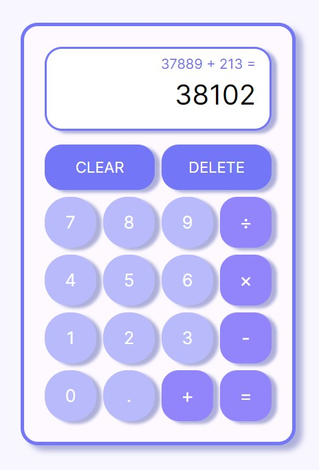

# Introduction
The objective is to create a simple on-screen calculator using HTML, CSS, and JavaScript. This is my third JavaScript project.

[👉 Live Demo](https://bravoosonja.github.io/calculator)

* supports keyboard input
* includes basic mathematic functions 
  - addition
  - subtraction
  - multiplication
  - division
* **CLEAR** clears the screen
* **DELETE** deletes the last single input


# Skills used
- HTML
- CSS
- JavaScript
# Lessons learned
- The most challenging part of this project was to determine the method of performing calculation. For example, 12 + 7 - 5 * 3 = should yield 42. Should I perform the calculation as a whole? (12 + 7 - 5 * 3) and call the calculating function by = ? If so, how do I fit all of that on the screen? What if user input is really long? This was resolved by performing calculation after each operand input and updating the display
  ```javascript
  secondOperand = currentOperationScreen.textContent;
  currentOperationScreen.textContent = roundResult(
    compute(currentOperation, firstOperand, secondOperand)
  );
  lastOperationScreen.textContent = `${firstOperand} ${currentOperation} ${secondOperand} =`;
  currentOperation = null;
  ```
- Initially, the screen did not reset after the operand input. Therefore, if the intention was to perform ```7+2```, the screen would display: ```7+7(from the previous input)2```. Resolved this by adding below in ```function chooseOperation()```

  ```javascript
  if (currentOperation !== null) updateDisplay();
  ```
   Solving this part of the problem helped in ```shouldResetScreen```value and setting those    value to true whenever it was necessary
# Future plans
- [ ] Include dark mode
- [ ] Incorporate more advanced mathematic functions such as % 
